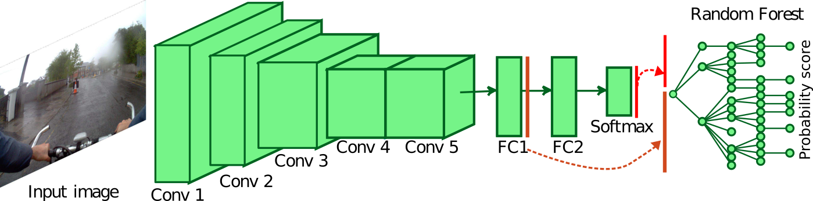

# Activity Recognition from Egocentric Photo-Streams

### Introduction

This repository contains the code used in the paper [Batch-Based Activity Recognition From Egocentric Photo-Streams Revisited](https://link.springer.com/article/10.1007%2Fs10044-018-0708-1)

<center></img></center>

If you use this code or its database, please consider citing:

	@Article{paa2018,
		author="Cartas, Alejandro
		and Mar{\'i}n, Juan
		and Radeva, Petia
		and Dimiccoli, Mariella",
		title="Batch-based activity recognition from egocentric photo-streams revisited",
		journal="Pattern Analysis and Applications",
		year="2018",
	}
### Contents
1. [Installation](#installation)
2. [Static Image Classification](#static)
3. [Downloads](#downloads)

### Installation

1. Clone this repository
  	```Shell
  	git clone --recursive https://github.com/gorayni/egocentric_photostreams.git

2. Download the NTCIR-12 dataset at http://ntcir-lifelog.computing.dcu.ie/NTCIR12/.

3. Create a symbolic link datasets/ntcir/images pointing to NTCIR_Lifelog_formal_run_Dataset/NTCIR-Lifelog_formal_run_images.

4. Split the data by executing the *Dataset split* notebook. This will create the cross-validation splits in the directory *data*.

### Static Image Classification

#### Training

Once the dataset was split, then the models can be trained by

```bash
python training/train_cnn.py --network=vgg-16 --data_dir=data/static --weights_dir=weights/vgg-16

python training/train_rf.py --network=vgg-16 --data_dir=data/static --weights_dir=weights/vgg-16 -l 'predictions' 'fc1' 
python training/train_rf.py --network=vgg-16 --data_dir=data/static --weights_dir=weights/vgg-16 -l 'fc1'
python training/train_rf.py --network=vgg-16 --data_dir=data/static --weights_dir=weights/vgg-16 -l 'fc2' 
python training/train_rf.py --network=vgg-16 --data_dir=data/static --weights_dir=weights/vgg-16 -l 'fc1' 'fc2'


python training/train_cnn.py --network=resNet50 --data_dir=data/static --weights_dir=weights/resNet50
python training/train_rf.py --network=resNet50 --data_dir=data/static --weights_dir=weights/resNet50 -l 'flatten_1'

python training/train_cnn.py --network=inceptionV3 --data_dir=data/static --weights_dir=weights/inceptionV3
python training/train_rf.py --network=inceptionV3 --data_dir=data/static --weights_dir=weights/inceptionV3 -l 'global_average_pooling2d_1' 
```

#### Testing

```bash
python testing/test_cnn.py --network=vgg-16 --data_dir=data/static --results_dir=results/vgg-16 --weights_dir=weights/vgg-16 

python testing/test_rf.py --network=vgg-16 --data_dir=data/static --results_dir=results/vgg-16 --weights_dir=weights/vgg-16 --layer 'predictions' 'fc1'
python testing/test_rf.py --network=vgg-16 --data_dir=data/static --results_dir=results/vgg-16 --weights_dir=weights/vgg-16 --layer 'fc1'
python testing/test_rf.py --network=vgg-16 --data_dir=data/static --results_dir=results/vgg-16 --weights_dir=weights/vgg-16 --layer 'fc2'
python testing/test_rf.py --network=vgg-16 --data_dir=data/static --results_dir=results/vgg-16 --weights_dir=weights/vgg-16 --layer 'fc1' 'fc2'

python testing/test_cnn.py --network=resNet50 --data_dir=data/static --results_dir=results/resNet50 --weights_dir=weights/resNet50

python testing/test_rf.py --network=resNet50 --data_dir=data/static --results_dir=results/resNet50 --weights_dir=weights/resNet50 --layer 'flatten_1'

python testing/test_cnn.py --network=inceptionV3 --data_dir=data/static --results_dir=results/inceptionV3 --weights_dir=weights/inceptionV3

python testing/test_rf.py --network=inceptionV3 --data_dir=data/static --results_dir=results/inceptionV3 --weights_dir=weights/inceptionV3 -l 'global_average_pooling2d_1'

```
### Downloads

#### Dataset

The NTCIR-12 photos are available on the official [website](http://ntcir-lifelog.computing.dcu.ie/NTCIR12/).

Our [annotations](https://github.com/gorayni/egocentric_photostreams/blob/master/datasets/ntcir/annotations.txt) and [categories](https://github.com/gorayni/egocentric_photostreams/blob/master/datasets/ntcir/categories.txt) are available in the *datasets/ntcir* directory of this repository.

#### Static Image Classification

1. VGG-16 [[CNN weights]](https://drive.google.com/open?id=1BFivA-sx1WugxfRCuAVgiD7qXccekgSV) [[RF (on FC1)]](https://drive.google.com/open?id=1uCyhFg2LAkCeHjMqJ7sOFy8ljEgjltdi) 

2. ResNet [[CNN weights]](https://drive.google.com/open?id=15wZ2oMj8MDjcLODDs7cdxnYjr7JVp6vA) [[RF]](https://drive.google.com/open?id=1lU1Sz53MTD3xoPwU3-F_z0GT3GvDfP_L) 

3. InceptionV3 [[CNN weights]](https://drive.google.com/open?id=1YOwg39Q6eWklBg17K_B15qfMjL6hAvWt) [[RF]](https://drive.google.com/open?id=1-GVeSnSETMqFrBr1KPSzJoHbJbqDPEVh)
